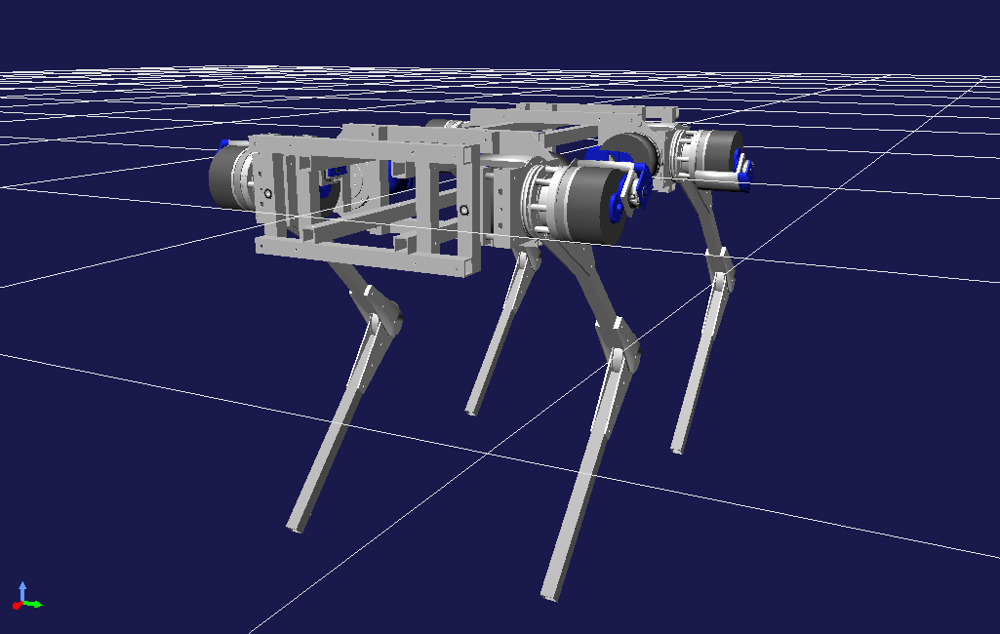

<link rel="shortcut icon" type="image/x-icon" href="/favicon.ico?">

## 四脚ロボット RevQuad の開発

四脚ロボット RevQuad を開発しています．
各脚3自由度，計12自由度を有し，脚長は760mm（脚先のアタッチメントを除く）です．
膝関節が前後に対して対称に可動するため，ソフトウェアによってロボットの前後を任意に割り当てることができます．
ロボット名の "Rev" は，この特性を表す reversible に由来します．

アクチュエータユニットは，出力2.9kWのブラシレスDCモータを搭載しています．
減速機やモータドライバは内製しています．

---

[研究開発トップへ戻る](../research)

[トップへ戻る](../..)
