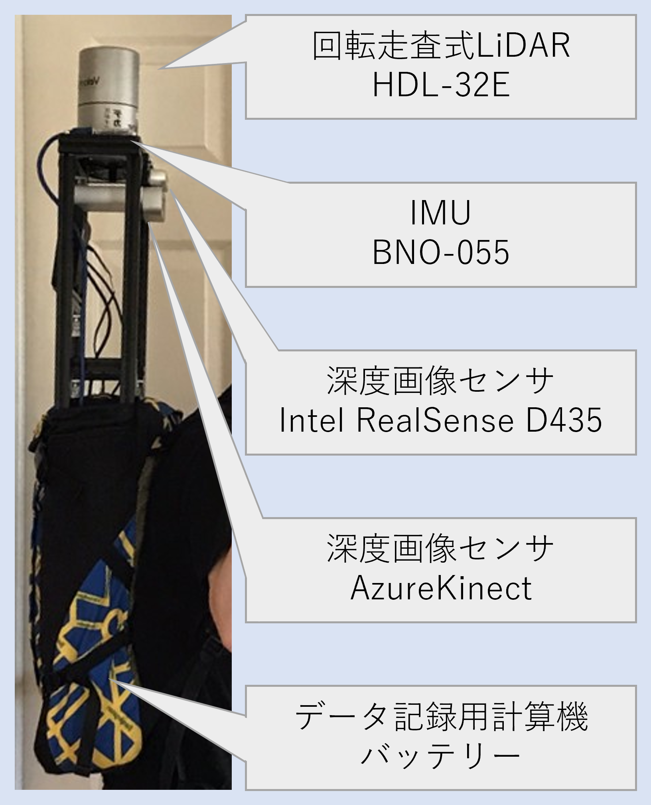

<link rel="shortcut icon" type="image/x-icon" href="/favicon.ico?">

## データ収集用センサユニットの製作

SLAM (Simultaneous Localization and Mapping) 等のアルゴリズム評価や，データセットの作成を行うためのセンサユニットを開発しました．
このユニットには，LiDAR，IMU（慣性計測装置），RGB-Dカメラ2種と，コンピュータ，そしてそれらの電源用バッテリが搭載されています．
これを人が背負って動くことで，脚ロボット特有の，鉛直方向の揺れや3次元回転を伴うセンサデータを取得することができます．

---

[研究開発トップへ戻る](../research)

[トップへ戻る](../..)
