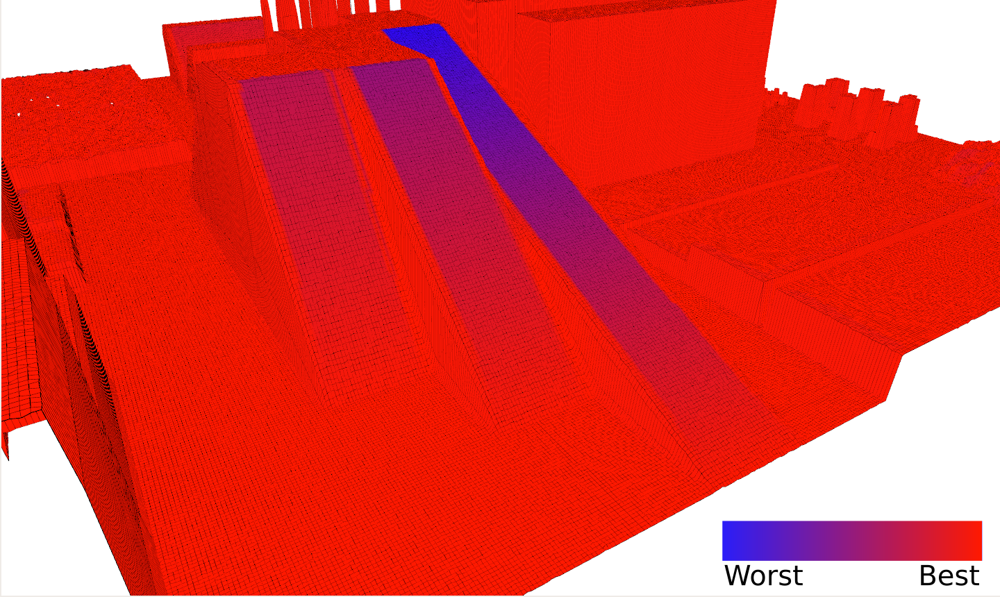

<link rel="shortcut icon" type="image/x-icon" href="/favicon.ico?">

## 滑りを考慮した路面の評価

実環境においては，路面が必ずしも「滑らない」という理想的な条件を満たすとは限りません．
そこで，[grid_map](https://github.com/ANYbotics/grid_map)を利用して，路面の勾配や粗さの情報をもとに，足を滑らす可能性を定量的に評価する手法を開発しています．
この情報を元にすることで，もし足を滑らせた場合にどのくらい滑ってしまうかということも評価できます．
これらの評価結果は，ロボットがどこに足を着くべきかという計画に利用できます．

---

[研究開発トップへ戻る](../research)

[トップへ戻る](../..)
